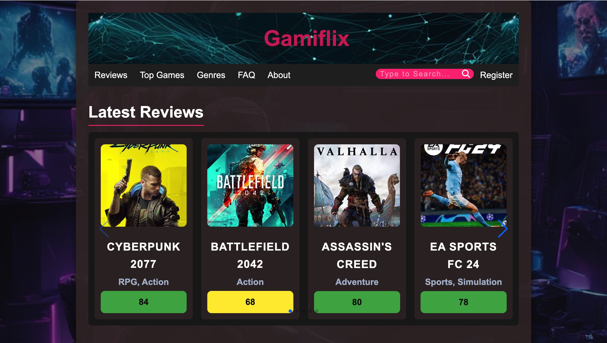
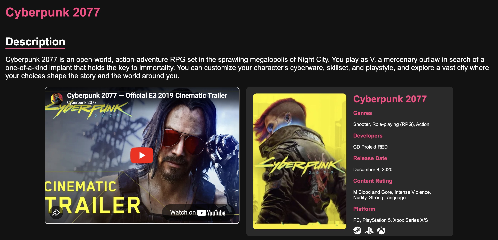
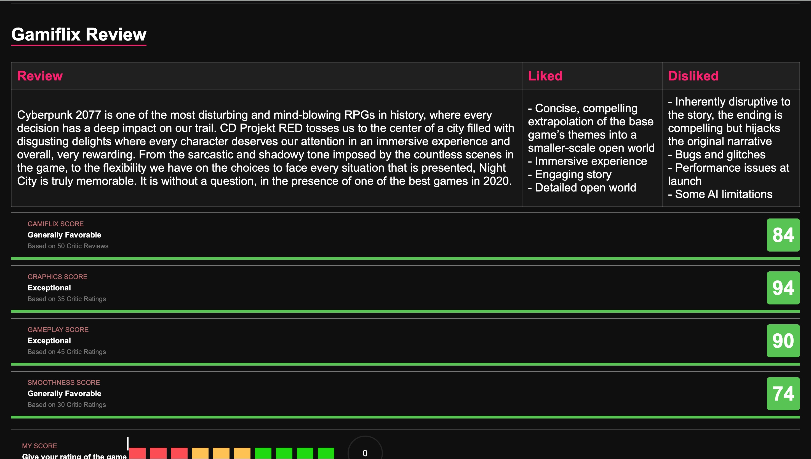
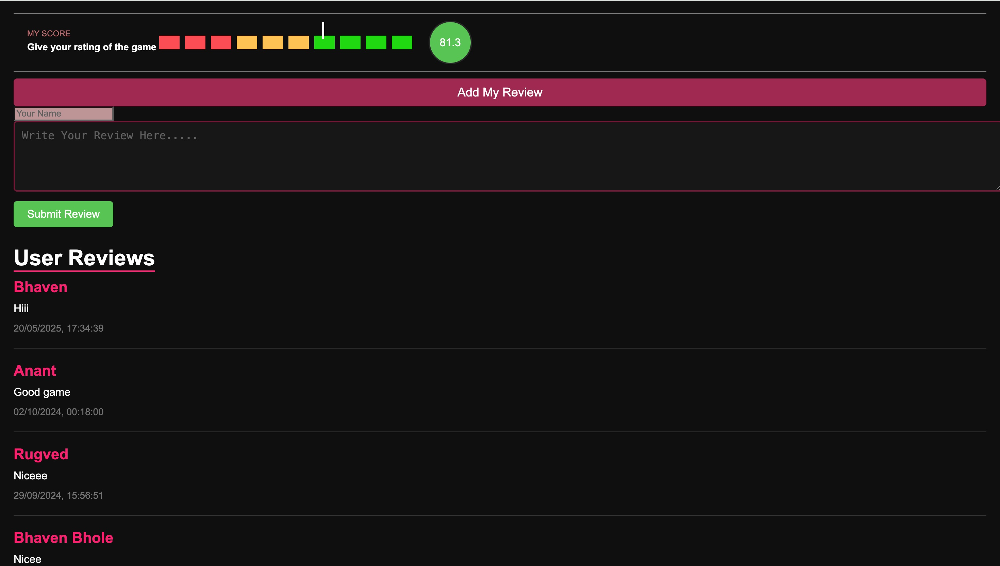

# 🎮 Gamiflix  
*A Community-Driven Game Review Website*

---

##  Overview
Gamiflix is a dynamic and interactive game review website designed to provide gamers with a trusted platform to explore, review, and rate video games across multiple genres. The platform emphasizes community-driven reviews, real-time updates, and a clean user interface, making it easy for users to discover and evaluate games.

---

##  Problem Statement
The gaming community often struggles with:
- Biased or sponsored game reviews  
- Cluttered and overwhelming review platforms  
- Limited user interaction and transparency  

Gamiflix addresses these challenges by offering a centralized, user-friendly, and unbiased platform where gamers can share genuine reviews and make informed decisions.

---

##  Project Objectives
- Provide a reliable platform for honest game reviews  
- Encourage community participation and engagement  
- Offer structured ratings and visual clarity  
- Deliver a smooth and responsive user experience  

---

##  Key Features
- **User Authentication**  
  Secure registration and login using Firebase Authentication.

- **Game Reviews & Ratings**  
  Users can submit, edit, and delete reviews with ratings on a 0–100 scale.

- **Real-Time Updates**  
  Reviews, ratings, and comments update instantly using Firebase Realtime Database.

- **Detailed Game Pages**  
  Each game includes:
  - Description  
  - Platform availability  
  - Cinematic trailer  
  - Expert and user reviews  

- **Search & Filtering**  
  Search games by name and filter by genre, rating, and platform.

- **Genre-Based Browsing**  
  Explore games across Action, Adventure, Sports, Strategy, and Indie genres.

- **Community Interaction**  
  Like/dislike features, comments, and dynamic user scores.

- **Responsive Design**  
  Optimized for desktops, tablets, and mobile devices.

---

##  Tech Stack
- **Frontend:** HTML, CSS, JavaScript  
- **Backend:** Firebase Realtime Database  
- **Authentication:** Firebase Authentication  
- **Hosting:** Web Hosting Platform  
- **Design:** Responsive UI / UX  

---

##  System Architecture
Gamiflix follows a modular web architecture:
- **Frontend Layer:** User interface and interactions  
- **Backend Layer:** Firebase services for authentication and data storage  
- **Database Layer:** Real-time syncing of reviews, ratings, and user data  

This ensures scalability, performance, and maintainability.

---

##  Screenshots

> Click on any section below to view screenshots.

---

<strong> Home Page</strong>

 

| Home Page |
|----------|
|  |
| **Home Page** – Displays featured games, scores, and quick navigation |

---

<strong> Game Details</strong>

 

| Game Details |
|-------------|
|  |
| **Game Details Page** – Description, trailer, platform info, and expert review |

---

<strong> Ratings</strong>

 

| Ratings |
|------------------|
|  |
| **Ratings Section** – Likes, dislikes, Gamilfix Score based on various parametrs |

---
| Reviews  |
|------------------|
|  |
| **Ratings Section** – user comments, and dynamic user scoring |

<strong> User Authentication</strong>

 

| Login / Register |
|-----------------|
|  |
| **Authentication** – Secure sign-in and sign-up using Firebase |

---

##  Future Enhancements
- AI-based game recommendations  
- Advanced analytics dashboard  
- Social features (profiles, followers)  
- Game news and updates section  
- PC compatibility checker  

---

##  Why This Project Matters
Gamiflix demonstrates:
- Strong frontend fundamentals  
- Real-time backend integration using Firebase  
- Clean UI/UX design principles  
- Scalable and maintainable web architecture  
- Practical problem-solving for real-world applications  
